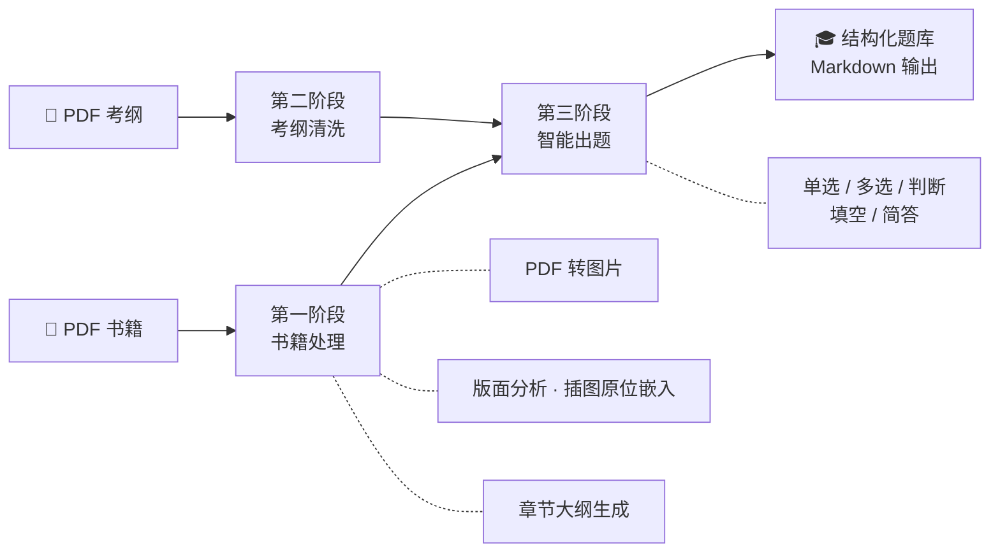

<div align="center">

# 🔥 ExamForge · 智题熔炉

### 把一本 PDF 丢进去，炼出一整套题库

**PDF 书籍 / 考试大纲 → AI 深度解析 → 结构化大纲 → 批量出题，一条流水线全自动完成**

<p>
  
  
  
  
  
</p>

<p>
  
  
  
  
</p>

[🚀 快速启动](#-快速启动) · [✨ 核心特性](#-核心特性) · [🔬 技术深潜](#-硬核技术深潜) · [🧠 工作原理](#-工作原理) · [📡 API](#-api-接口) · [📚 文档](#-项目文档)

</div>

---

## 🎯 这是什么？

**ExamForge** 是一座「题目熔炉」：你只需要投喂 **PDF 教材** 和 **考试大纲**，它会自动完成 **版面分析 → 原文提取 → 知识大纲 → 智能出题** 的完整炼制流程，最终交付一套覆盖 **单选 / 多选 / 判断 / 填空 / 简答** 的结构化题库。   ----作者 FX42S

> 💡 本地运行，数据不出内网 —— 基于 LM Studio 本地大模型，无需联网、无需 API Key、零 token 费用。

---

## ✨ 核心特性

| 特性 | 说明 |
|------|------|
| 🏭 **三阶段流水线** | 书籍解析 → 考纲清洗 → 智能出题，全自动串联 |
| 🖼️ **版面分析引擎** | 多模态模型识别页面布局，插图按**原始位置**嵌入 Markdown，不再文末堆砌 |
| 🧩 **智能分段出题** | 按原文长度动态计算题量（5–100 题/章），4000 字符分段投喂，题题有据 |
| ⚡ **三种工作模式** | 完整三阶段 / 仅书籍 / 快速出题（一份考纲直出 500 题） |
| 📥 **任务队列** | 单线程队列依次处理，最多排队 50 个任务，关掉浏览器照跑不误 |
| 🔌 **完整 REST API** | SpringDoc OpenAPI 文档自动生成，可对接任何前端或系统 |
| 🛡️ **优雅降级** | 版面分析失败自动回退纯 OCR 模式，流水线永不中断 |

---

## 🔬 硬核技术深潜

> 这一部分写给真正关心工程实现的你 —— 每一个亮点背后都是实打实踩过的坑。

### 1️⃣ 多模态版面分析引擎 · Java ↔ Python 跨语言进程编排

插图不是「提取出来堆在文末」，而是**按页面原始坐标嵌回正文**：

```
PDF 页面 → 多模态模型识别文字/插图区域（返回相对坐标 bbox）
        → 按 bbox 精准裁剪插图 → figures/ 目录
        → [FIGURE:N] 占位符 → 原位置替换为 Markdown 图片链接
```

- 🔧 **进程编排**：Java 端自动探测 `python3` / `python` / `py`，构造 CLI 参数调起 `pdf_layout_analyzer.py`
- ⏱️ **超时熔断**：异步读取子进程 stdout，每张图片 60s 超时，单页卡死绝不拖垮整本书
- 🛡️ **优雅降级**：版面分析失败自动回退纯 OCR 文字提取，流水线可用性 100%
- 🎚️ **配置开关**：`pdf.layout.analyzer.enabled` 一键切换两种引擎

### 2️⃣ 自适应分块出题引擎

不是粗暴地「把整章丢给 AI 出题」，而是一套**量化驱动的出题策略**：

| 策略 | 实现 |
|------|------|
| 📏 **动态题量** | 按章节原文长度计算题量，每章 5–100 题弹性伸缩 |
| ✂️ **智能分段** | 原文按 4000 字符分块，规避上下文窗口溢出 |
| 🧪 **三重上下文注入** | 每段投喂 `原文 + 章节大纲 + 完整考纲`，题题对标考点 |
| 📝 **结构化 Prompt** | 强制 `{编号}-选/判/填` 输出模板，答案 + 解析一并生成 |

### 3️⃣ 工业级鲁棒性设计

AI 输出是不可信的 —— 系统为此构建了**多层兜底防线**：

- 🔤 **OTF 字体兜底渲染**：PDFBox 遇到嵌入字体渲染失败时，自动切换文本绘制方案，绝不出空白页
- 🧹 **AI 输出多重解析**：Prompt 格式约束 + 后端多重解析规则 + 异常章节过滤，三层防线
- 📑 **10+ 种目录格式识别**：`第1章` / `第一章` / `Module 1` / `项目一` / `专题一` / `教学单元一`… 统一归一化为章节结构
- 🚮 **非正文页清洗**：自动识别并剔除封面 / 版权页 / 目录页，正文图片重编号为 `page_0001.png`

### 4️⃣ 任务调度 · SSE 实时推送

- 📥 **单线程有序队列**：pdfbook / only 模式最大排队 **50**，fast 模式最大排队 **10**，资源可控
- 📡 **SSE（Server-Sent Events）实时推送**：任务进度、当前步骤、百分比实时推送到前端，无需轮询
- 🔌 **断连续跑**：任务在服务端后台执行，关闭浏览器不影响处理，回来随时查进度
- 💓 **健康检查**：`GET /api/health` 一键探活

### 5️⃣ 长上下文压榨

`lmstudio.max.tokens = 150000` —— 把本地 9B 模型的上下文窗口压榨到极限，单次对话处理整章内容无压力。

---

## 🧠 工作原理



<details>
<summary>📖 展开查看完整处理流程</summary>

```
用户上传：PDF 书籍 + PDF 考试大纲
                ↓
        ┌─────────────────┐
        │  第一阶段：书籍处理  │
        └─────────────────┘
                ↓
   PDF 转图片 → 版面分析 → 提取目录 → 清理非正文页
                ↓
   按章节提取原文（插图原位嵌入）→ 生成章节大纲
                ↓
        ┌─────────────────┐
        │  第二阶段：考纲处理  │
        └─────────────────┘
                ↓
   AI 清洗考纲（删废话、留考点）
                ↓
        ┌─────────────────┐
        │  第三阶段：生成题目  │
        └─────────────────┘
                ↓
   原文 + 大纲 + 考纲 → AI 出题 → 题目汇总 → finish.md ✅
```

</details>

---

## 🎛️ 三种工作模式

| 模式 | 入口页面 | 输入 | 产出 | 适用场景 |
|------|----------|------|------|----------|
| 🏭 **完整三阶段** | `/pdfbook.html` | PDF 书籍 + PDF 考纲 | 原文 + 大纲 + 题目 | 正规备考，严格对标考纲 |
| 📕 **仅书籍模式** | `/only.html` | PDF 书籍 | 原文 + 大纲 + 题目 | 没有考纲，吃透整本书 |
| ⚡ **快速题目模式** | `/fast.html` | PDF 考纲 | 直出 **500 题** | 考前突击，题海战术 |

---

## 🚀 快速启动

### 前置要求

- ☕ JDK 21+
- 🤖 [LM Studio](https://lmstudio.ai/)（已加载模型并开启本地 API）
- 🐍 Python 3 + `pip install -r src/main/python/requirements.txt`（版面分析可选依赖）

### 1️⃣ 配置 AI 模型

编辑项目根目录 `config.json`：

```json
{
  "lmstudio.api.url": "http://localhost:1234/v1/chat/completions",
  "lmstudio.model.name": "qwen/qwen3.5-9b",
  "lmstudio.max.tokens": "150000",
  "pdf.layout.analyzer.enabled": "true"
}
```

### 2️⃣ 启动 LM Studio

确保 LM Studio 已启动、模型已加载、本地 API 可访问。

### 3️⃣ 一键启动

```bash
mvn spring-boot:run
```

🎉 打开浏览器访问 **http://localhost:8188**，开始炼题！

---

## 📂 输出成果

所有炼制成果沉淀在 `output/` 目录：

```
output/
├── 数据结构_20260101_120000/          # 书籍模式产出
│   ├── 00_目录.md                     # 📑 全书目录
│   ├── 00_汇总.md                     # 📊 内容汇总
│   ├── 00_题目汇总.md                 # 🎓 题库总览
│   ├── 处理进度.md                    # ⏱️ 实时进度
│   ├── 书籍第1章_xxx_原文.md          # 📖 章节原文（插图原位嵌入）
│   ├── 书籍第1章_xxx_大纲.md          # 🧭 章节大纲
│   ├── 题目第1章.md                   # ✍️ 章节题目
│   └── finish.md                      # ✅ 完成标记
└── 数据结构考试大纲/                   # 快速模式产出
    ├── 数据结构考试大纲.md
    └── finish.md
```

---

## 📡 API 接口

系统对外提供完整 REST API，统一响应格式 `{ success, message, data }`，并集成 **SpringDoc OpenAPI**，启动后访问 `/swagger-ui.html` 即可在线调试。

| 端点 | 方法 | 说明 |
|------|------|------|
| `/api/health` | GET | 💓 服务健康检查 |
| `/api/fast/generate` | POST | ⚡ 单份考纲提交，直出 500 题 |
| `/api/fast/generate/batch` | POST | 📦 批量考纲提交 |
| `/api/fast/task/{taskId}` | GET | 🔍 任务状态 / 进度查询 |
| 任务队列系列 | — | 📥 书籍任务提交 + **SSE 实时进度订阅** |

<details>
<summary>📮 curl 示例：提交一份考纲生成 500 题</summary>

```bash
curl -X POST "http://localhost:8188/api/fast/generate" \
  -F "file=@考试大纲.pdf" \
  -F "filename=数据结构考试大纲"
```

```json
{
  "success": true,
  "message": "任务已提交",
  "data": {
    "taskId": "f47ac10b-58cc-4372-a567-0e02b2c3d479",
    "status": "pending",
    "message": "等待处理"
  }
}
```

</details>

详细接口说明见 [api-documentation.md](api-documentation.md)。

---

## 🔧 配置项详解

`config.json` 全部配置一览：

| 配置项 | 说明 | 示例 |
|--------|------|------|
| `lmstudio.api.url` | OpenAI 兼容接口地址（可指向局域网任意推理节点） | `http://192.168.100.51:1234/v1/chat/completions` |
| `lmstudio.model.name` | 模型标识 | `qwen/qwen3.5-9b` |
| `lmstudio.max.tokens` | 上下文窗口上限 | `150000` |
| `lmstudio.ocr.prompt` | 知识点提取 + 出题的结构化 Prompt 模板 | 见配置文件 |
| `pdf.layout.analyzer.enabled` | 版面分析引擎开关（false 回退纯 OCR） | `true` |

> 🌐 **分布式部署彩蛋**：API 地址支持指向局域网内任意 LM Studio 推理节点 —— GPU 服务器跑模型，普通机器跑服务，算力与业务解耦。

---

## 🏗️ 技术架构

```
orc-app/
├── src/main/java/com/ocr/app/
│   ├── controller/        # 🎮 REST 接口层（书籍/快速出题/任务/健康检查）
│   ├── service/           # ⚙️ 核心服务层
│   │   ├── converter/     #    PDF 转换
│   │   ├── AiService              # AI 调用
│   │   ├── PdfBookAnalysisService # 书籍三阶段流水线
│   │   ├── PdfLayoutAnalyzerService # 版面分析调度
│   │   ├── ExamOutlineService     # 考纲清洗
│   │   ├── FastQuestionService    # 快速出题
│   │   └── TaskQueueService       # 任务队列
│   └── dto/               # 📦 数据传输对象
├── src/main/python/       # 🐍 版面分析脚本（多模态 bbox 识别）
├── src/main/resources/static/  # 🖥️ 原生三件套前端
├── project-docs/          # 📚 项目文档
├── output/                # 🎓 炼题成果
└── config.json            # 🔧 AI 模型配置
```

**技术栈**：`Spring Boot 3.2` · `JDK 21` · `PDFBox 3.0` · `Apache POI` · `LM Studio (OpenAI 兼容 API)` · `Python 多模态版面分析` · `原生 HTML/CSS/JS`

---

## 📚 项目文档

| 文档 | 说明 |
|------|------|
| 📡 [api-documentation.md](api-documentation.md) | 完整 API 接口文档 |
| 🔄 [workflows.md](workflows.md) | 各模式详细工作流程 |
| 🛠️ [development-guide.md](development-guide.md) | 开发指南 |
| 🚑 [troubleshooting.md](troubleshooting.md) | 故障排查手册 |
| 🗄️ [database-schema.md](database-schema.md) | 数据库表结构 |

---

## 🗺️ Roadmap

- [x] 三阶段流水线 & 三种工作模式
- [x] 多模态版面分析 · 插图原位嵌入（v1.1.0）
- [x] 任务队列 & 后台处理
- [x] 原文处理实现抠书籍原图
- [ ] 题目导出 Word / Excel / Anki
- [ ] 题库在线刷题模式
- [ ] 多模型负载均衡

---

<div align="center">

**如果这个项目帮到了你，请给一个 ⭐ Star 支持一下！**

Made with 🔥 by ExamForge · 把知识炼成题

</div>
